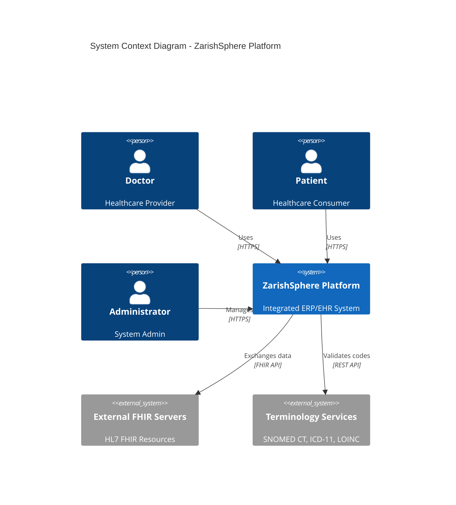
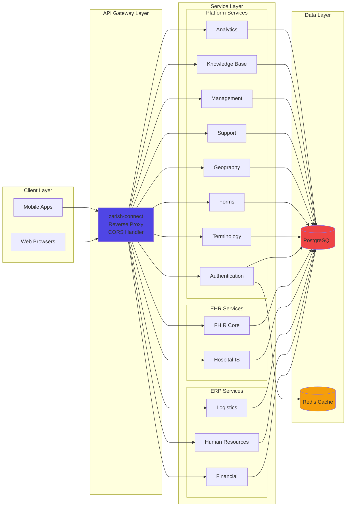
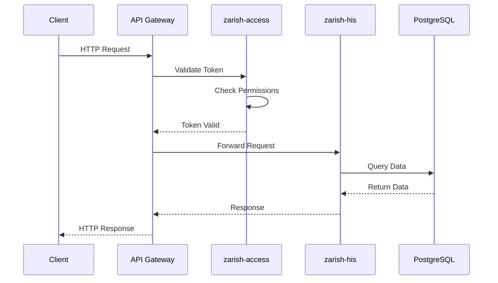
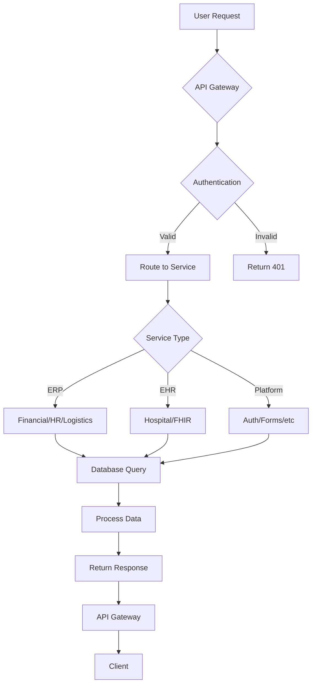
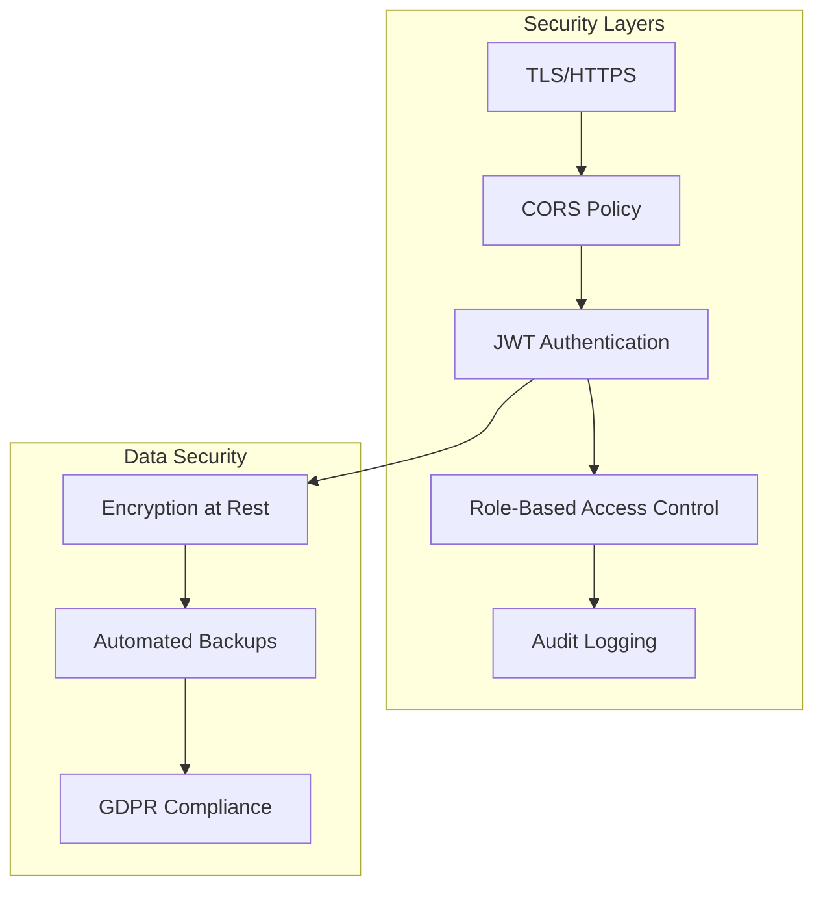
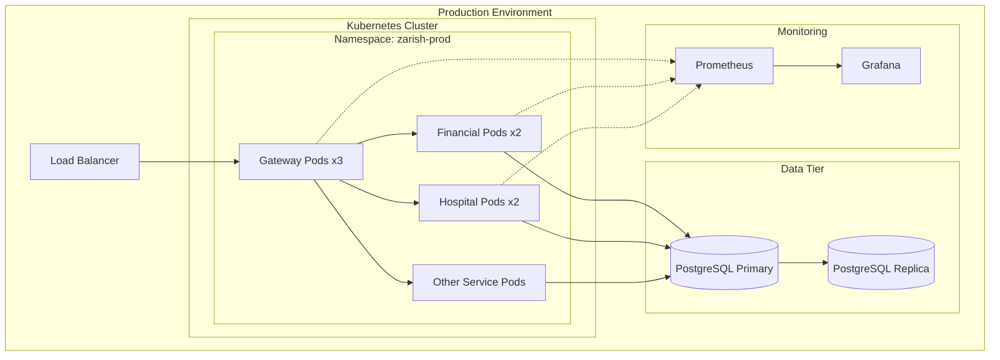

# Architecture Overview

## System Architecture

ZarishSphere Platform follows a **microservices architecture** with clear separation of concerns.

## High-Level Architecture

## Microservices Architecture

## Service Communication

## Data Flow

## Technology Decisions

### Backend: Go

- **Performance**: Compiled language, fast execution
- **Concurrency**: Built-in goroutines for handling multiple requests
- **Type Safety**: Strong typing reduces runtime errors
- **Ecosystem**: Rich libraries for web services (Gin, GORM)

### Database: PostgreSQL

- **ACID Compliance**: Ensures data integrity
- **JSON Support**: Native JSONB for flexible schemas
- **Scalability**: Proven at enterprise scale
- **FHIR Support**: Excellent for healthcare data

### API Gateway: Gin

- **Performance**: One of the fastest Go web frameworks
- **Middleware**: Easy to add authentication, logging, CORS
- **Routing**: Clean and intuitive routing

## Security Architecture

## Deployment Architecture

## Scalability

### Horizontal Scaling

- Each microservice can scale independently
- Stateless services enable easy replication
- Load balancer distributes traffic

### Vertical Scaling

- Database can be upgraded for more resources
- Individual services can be allocated more CPU/memory

### Caching Strategy

- Redis for session management
- API response caching
- Database query result caching

## High Availability

- **Multi-instance deployment**: Each service runs multiple instances
- **Database replication**: Primary-replica setup
- **Health checks**: Automatic pod restart on failure
- **Circuit breakers**: Prevent cascade failures
