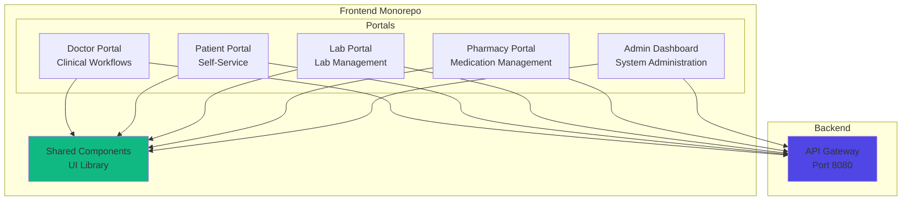

# Frontend Overview

ZarishSphere Platform includes **5 specialized portals** built as a monorepo.

## Portal Architecture



## Technology Stack

- **Framework:** React 18+
- **Language:** TypeScript
- **Build Tool:** Vite
- **State Management:** React Query + Zustand
- **UI Library:** Material-UI (MUI)
- **Routing:** React Router v6
- **Forms:** React Hook Form + Zod
- **Charts:** Recharts
- **Icons:** Material Icons

## Monorepo Structure

```
zarish-sphere-frontend/
├── src/
│   ├── doctor-portal/       # Doctor interface
│   ├── patient-portal/      # Patient interface
│   ├── lab-portal/          # Laboratory interface
│   ├── pharmacy-portal/     # Pharmacy interface
│   ├── admin-dashboard/     # Admin interface
│   └── shared/              # Shared components
├── package.json             # Workspace configuration
└── vite.config.ts          # Build configuration
```

## Shared Components

### UI Components

- **Layout**: AppBar, Sidebar, Footer
- **Forms**: Input, Select, DatePicker, FileUpload
- **Data Display**: Table, Card, List, Badge
- **Feedback**: Alert, Dialog, Snackbar, Progress
- **Navigation**: Tabs, Breadcrumbs, Pagination

### Utilities

- **API Client**: Axios wrapper with interceptors
- **Auth**: Authentication hooks and guards
- **Validation**: Form validation schemas
- **Formatting**: Date, currency, phone formatters
- **Hooks**: Custom React hooks

## Development

```bash
# Install dependencies
npm install

# Start all portals
npm run dev

# Start specific portal
npm run dev:doctor
npm run dev:patient
npm run dev:lab
npm run dev:pharmacy
npm run dev:admin

# Build for production
npm run build

# Run tests
npm test
```

## Portal Details

- [Doctor Portal](doctor-portal.md)
- [Patient Portal](patient-portal.md)
- [Lab Portal](lab-portal.md)
- [Pharmacy Portal](pharmacy-portal.md)
- [Admin Dashboard](admin-dashboard.md)
