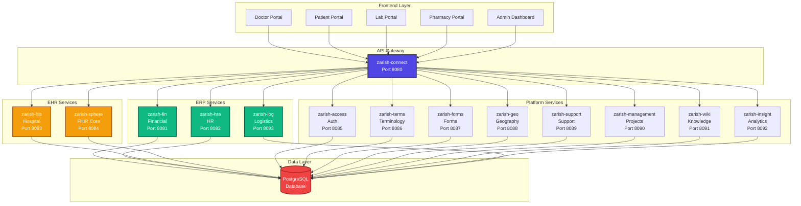

# ZarishSphere Platform


## Welcome to ZarishSphere

A comprehensive **ERP/EHR integrated platform** combining enterprise resource planning with electronic health records, built on FHIR standards.

## 🎯 Overview

ZarishSphere Platform is a modern, microservices-based healthcare and business management system that seamlessly integrates:

- **ERP Capabilities**: Financial management, HR, logistics
- **EHR Capabilities**: Patient records, clinical data, FHIR compliance
- **Platform Services**: Authentication, forms, analytics, knowledge base

## 🏗️ Architecture



## ✨ Key Features

### ERP Modules

- **Financial Management** (`zarish-fin`): Complete accounting, journal entries, chart of accounts
- **Human Resources** (`zarish-hra`): Employee management, departments, payroll
- **Logistics** (`zarish-log`): Inventory, shipment tracking, supply chain

### EHR Modules

- **Hospital Information System** (`zarish-his`): Patient records, encounters, FHIR-compliant
- **FHIR Core** (`zarish-sphere`): Practitioners, organizations, locations

### Platform Services

- **Authentication** (`zarish-access`): User management, roles, permissions
- **Terminology** (`zarish-terms`): SNOMED CT, ICD-11, LOINC
- **Forms** (`zarish-forms`): Dynamic form builder with JSON schema
- **Geography** (`zarish-geo`): Administrative divisions, districts
- **Support** (`zarish-support`): Ticket management system
- **Project Management** (`zarish-management`): Tasks, projects, collaboration
- **Knowledge Base** (`zarish-wiki`): Documentation, articles
- **Analytics** (`zarish-insight`): Dashboards, reports, metrics

## 🚀 Quick Start

### Using Docker Compose

```bash
# Clone the repository
git clone https://github.com/ZarishSphere-Platform/zarish-sphere-frontend.git

# Start all services
docker-compose up -d

# Access the API Gateway
curl http://localhost:8080/health
```

### Manual Setup

```bash
# Start individual services
cd zarish-fin && go run cmd/server/main.go  # Port 8081
cd zarish-hra && go run cmd/server/main.go  # Port 8082
cd zarish-his && go run cmd/server/main.go  # Port 8083
cd zarish-connect && go run cmd/server/main.go  # Port 8080
```

## 📊 Technology Stack

| Layer | Technology |
|-------|-----------|
| **Backend** | Go 1.21+, Gin, GORM |
| **Database** | PostgreSQL 15 |
| **Frontend** | React, TypeScript, Vite |
| **API** | REST, FHIR R4 |
| **DevOps** | Docker, Kubernetes, GitHub Actions |

## 📖 Documentation

- [Architecture Overview](architecture/overview.md)
- [Module Documentation](modules/zarish-fin.md)
- [API Reference](api/financial.md)
- [Deployment Guide](deployment/quickstart.md)

## 🤝 Contributing

We welcome contributions! Please see our [Contributing Guide](contributing.md).

## 📄 License

Copyright © 2025 ZarishSphere Platform. All rights reserved.

## 🔗 Links

- [GitHub Organization](https://github.com/ZarishSphere-Platform)
- [Documentation](https://zarishsphere-platform.github.io/zarish-sphere-frontend/)
- [API Gateway](http://localhost:8080)
