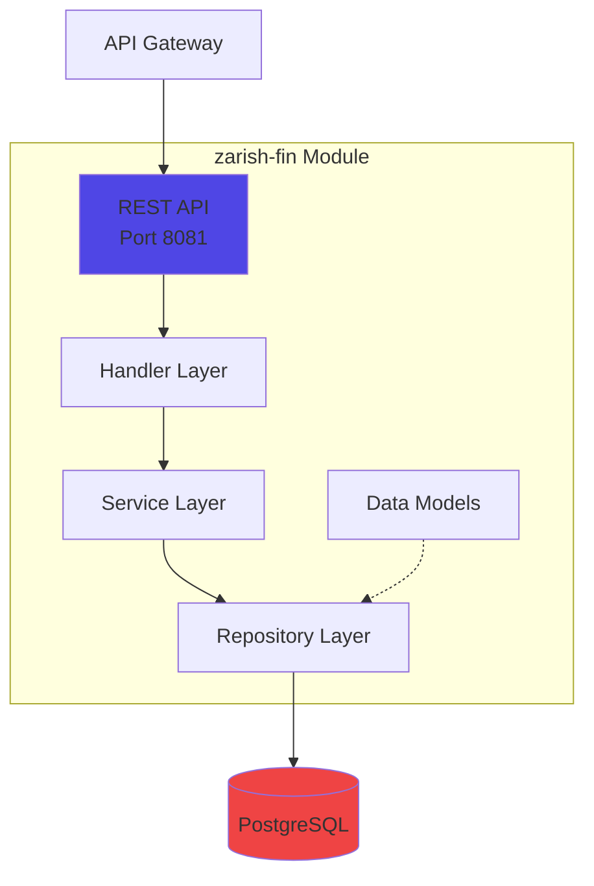

# zarish-fin - Financial Management Module

## Overview

The Financial Management module provides comprehensive ERP accounting capabilities based on Odoo's financial models.

**Repository:** [zarish-fin](https://github.com/ZarishSphere-Platform/zarish-fin)  
**Port:** 8081  
**Status:** ✅ Production Ready with Full API

## Features

- **Journal Entry Management**: Create and manage accounting journal entries
- **Chart of Accounts**: Hierarchical account structure
- **Multi-currency Support**: Handle multiple currencies
- **Account Move Lines**: Detailed debit/credit tracking

## Architecture



## Data Models

### AccountMove
Journal entries representing financial transactions.

```go
type AccountMove struct {
    ID          uint
    Name        string    // Journal entry number
    Date        time.Time // Accounting date
    State       string    // draft, posted, cancelled
    MoveType    string    // entry, out_invoice, in_invoice
    PartnerID   *uint     // Related partner
    Amount      float64   // Total amount
    Lines       []AccountMoveLine
}
```

### AccountMoveLine
Individual debit/credit lines within a journal entry.

```go
type AccountMoveLine struct {
    ID          uint
    MoveID      uint      // Parent journal entry
    AccountID   uint      // Chart of accounts reference
    Name        string    // Line description
    Debit       float64   // Debit amount
    Credit      float64   // Credit amount
    Balance     float64   // Running balance
}
```

### Account
Chart of accounts entries.

```go
type Account struct {
    ID          uint
    Code        string    // Account code
    Name        string    // Account name
    AccountType string    // asset, liability, equity, income, expense
    Reconcile   bool      // Requires reconciliation
}
```

## API Endpoints

### Create Journal Entry

```http
POST /api/v1/journal-entries
Content-Type: application/json

{
  "name": "INV-2025-001",
  "date": "2025-01-15T00:00:00Z",
  "state": "draft",
  "move_type": "out_invoice",
  "amount": 1000.00
}
```

### Get Journal Entry

```http
GET /api/v1/journal-entries/{id}
```

### List Journal Entries

```http
GET /api/v1/journal-entries?page=1&page_size=10
```

## Usage Example

```bash
# Via API Gateway
curl -X POST http://localhost:8080/api/fin/api/v1/journal-entries \
  -H "Content-Type: application/json" \
  -d '{
    "name": "INV-001",
    "date": "2025-01-01T00:00:00Z",
    "state": "draft"
  }'
```

## Running the Service

```bash
# Clone repository
git clone https://github.com/ZarishSphere-Platform/zarish-fin.git
cd zarish-fin

# Install dependencies
go mod download

# Run server
go run cmd/server/main.go
```

## Configuration

Environment variables:

- `DB_HOST`: PostgreSQL host (default: localhost)
- `DB_PORT`: PostgreSQL port (default: 5432)
- `DB_USER`: Database user (default: postgres)
- `DB_PASSWORD`: Database password
- `DB_NAME`: Database name (default: zarish_fin)

## Technology Stack

- **Language:** Go 1.21+
- **Framework:** Gin Web Framework
- **ORM:** GORM
- **Database:** PostgreSQL 15
- **CI/CD:** GitHub Actions
