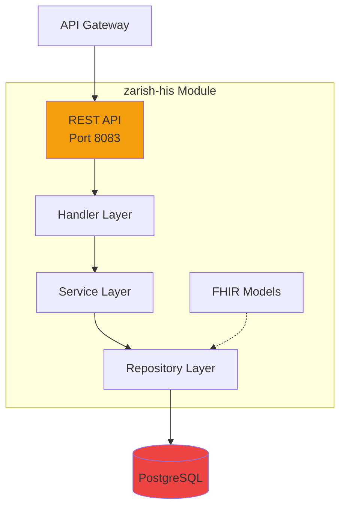

# zarish-his - Hospital Information System

## Overview

The Hospital Information System (HIS) module provides comprehensive FHIR-compliant patient and encounter management for healthcare facilities.

**Repository:** [zarish-his](https://github.com/ZarishSphere-Platform/zarish-his)  
**Port:** 8083  
**Status:** ✅ Production Ready with Full API  
**FHIR Version:** R4

## Features

- **Patient Management**: FHIR-compliant patient records
- **Encounter Tracking**: Visit and admission management
- **Clinical Data**: Observations, conditions, procedures
- **FHIR Resources**: Patient, Encounter, Observation, Condition

## Architecture



## FHIR Data Models

### Patient Resource

Complete FHIR R4 Patient resource implementation.

```go
type Patient struct {
    Base
    
    // Identifiers
    MRN         string    `json:"mrn" gorm:"uniqueIndex"`  // Medical Record Number
    Identifier  string    `json:"identifier"`
    
    // Demographics
    FirstName   string    `json:"first_name"`
    LastName    string    `json:"last_name"`
    MiddleName  string    `json:"middle_name"`
    Gender      string    `json:"gender"`  // male, female, other, unknown
    BirthDate   time.Time `json:"birth_date"`
    
    // Contact
    Phone       string    `json:"phone"`
    Email       string    `json:"email"`
    
    // Address
    AddressLine string    `json:"address_line"`
    City        string    `json:"city"`
    State       string    `json:"state"`
    PostalCode  string    `json:"postal_code"`
    Country     string    `json:"country"`
    
    // Clinical
    BloodType   string    `json:"blood_type"`  // A+, A-, B+, B-, AB+, AB-, O+, O-
    Active      bool      `json:"active"`
    
    // Relationships
    Encounters  []Encounter `json:"encounters,omitempty" gorm:"foreignKey:PatientID"`
}
```

### Encounter Resource

FHIR R4 Encounter for tracking patient visits.

```go
type Encounter struct {
    Base
    
    PatientID      uint      `json:"patient_id"`
    Patient        *Patient  `json:"patient,omitempty" gorm:"foreignKey:PatientID"`
    
    // Encounter Details
    Status         string    `json:"status"`  // planned, arrived, in-progress, finished, cancelled
    Class          string    `json:"class"`   // inpatient, outpatient, emergency, home-health
    Type           string    `json:"type"`
    Priority       string    `json:"priority"` // routine, urgent, emergency
    
    // Participants
    PractitionerID *uint     `json:"practitioner_id"`
    
    // Timing
    StartTime      time.Time `json:"start_time"`
    EndTime        *time.Time `json:"end_time"`
    
    // Location
    LocationID     *uint     `json:"location_id"`
    
    // Reason
    ReasonCode     string    `json:"reason_code"`
    ReasonDisplay  string    `json:"reason_display"`
}
```

## FHIR Dictionaries & Metadata

### Patient Gender Value Set

```json
{
  "resourceType": "ValueSet",
  "id": "administrative-gender",
  "url": "http://hl7.org/fhir/ValueSet/administrative-gender",
  "name": "AdministrativeGender",
  "status": "active",
  "compose": {
    "include": [{
      "system": "http://hl7.org/fhir/administrative-gender",
      "concept": [
        {
          "code": "male",
          "display": "Male",
          "definition": "Male gender"
        },
        {
          "code": "female",
          "display": "Female",
          "definition": "Female gender"
        },
        {
          "code": "other",
          "display": "Other",
          "definition": "Other gender"
        },
        {
          "code": "unknown",
          "display": "Unknown",
          "definition": "Unknown gender"
        }
      ]
    }]
  }
}
```

### Blood Type Value Set

```json
{
  "resourceType": "ValueSet",
  "id": "blood-type",
  "name": "BloodType",
  "status": "active",
  "compose": {
    "include": [{
      "system": "http://snomed.info/sct",
      "concept": [
        {"code": "112144000", "display": "A+"},
        {"code": "165743006", "display": "A-"},
        {"code": "112149005", "display": "B+"},
        {"code": "165747007", "display": "B-"},
        {"code": "112152002", "display": "AB+"},
        {"code": "165750005", "display": "AB-"},
        {"code": "58460004", "display": "O+"},
        {"code": "165746003", "display": "O-"}
      ]
    }]
  }
}
```

### Encounter Status Value Set

```json
{
  "resourceType": "ValueSet",
  "id": "encounter-status",
  "url": "http://hl7.org/fhir/ValueSet/encounter-status",
  "name": "EncounterStatus",
  "status": "active",
  "compose": {
    "include": [{
      "system": "http://hl7.org/fhir/encounter-status",
      "concept": [
        {"code": "planned", "display": "Planned"},
        {"code": "arrived", "display": "Arrived"},
        {"code": "triaged", "display": "Triaged"},
        {"code": "in-progress", "display": "In Progress"},
        {"code": "onleave", "display": "On Leave"},
        {"code": "finished", "display": "Finished"},
        {"code": "cancelled", "display": "Cancelled"}
      ]
    }]
  }
}
```

### Encounter Class Value Set

```json
{
  "resourceType": "ValueSet",
  "id": "encounter-class",
  "name": "EncounterClass",
  "status": "active",
  "compose": {
    "include": [{
      "system": "http://terminology.hl7.org/CodeSystem/v3-ActCode",
      "concept": [
        {"code": "AMB", "display": "Ambulatory (Outpatient)"},
        {"code": "EMER", "display": "Emergency"},
        {"code": "IMP", "display": "Inpatient"},
        {"code": "ACUTE", "display": "Inpatient Acute"},
        {"code": "NONAC", "display": "Inpatient Non-Acute"},
        {"code": "OBSENC", "display": "Observation Encounter"},
        {"code": "PRENC", "display": "Pre-Admission"},
        {"code": "SS", "display": "Short Stay"},
        {"code": "VR", "display": "Virtual"}
      ]
    }]
  }
}
```

## API Endpoints

### Create Patient

```http
POST /api/v1/patients
Content-Type: application/json

{
  "mrn": "MRN001",
  "first_name": "John",
  "last_name": "Doe",
  "gender": "male",
  "birth_date": "1990-01-15T00:00:00Z",
  "phone": "+1234567890",
  "email": "john.doe@example.com",
  "blood_type": "O+",
  "active": true
}
```

**Response:** `201 Created`

```json
{
  "id": 1,
  "mrn": "MRN001",
  "first_name": "John",
  "last_name": "Doe",
  "gender": "male",
  "birth_date": "1990-01-15T00:00:00Z",
  "phone": "+1234567890",
  "email": "john.doe@example.com",
  "blood_type": "O+",
  "active": true,
  "created_at": "2025-01-15T10:30:00Z"
}
```

### Get Patient

```http
GET /api/v1/patients/{id}
```

### List Patients

```http
GET /api/v1/patients?page=1&page_size=10
```

### Create Encounter

```http
POST /api/v1/encounters
Content-Type: application/json

{
  "patient_id": 1,
  "status": "in-progress",
  "class": "AMB",
  "type": "Routine Checkup",
  "priority": "routine",
  "start_time": "2025-01-15T14:00:00Z",
  "reason_code": "Z00.00",
  "reason_display": "Encounter for general adult medical examination without abnormal findings"
}
```

## Form Building Metadata

### Patient Registration Form Schema

```json
{
  "formId": "patient-registration",
  "title": "Patient Registration",
  "version": "1.0",
  "sections": [
    {
      "id": "demographics",
      "title": "Demographics",
      "fields": [
        {
          "id": "mrn",
          "label": "Medical Record Number",
          "type": "text",
          "required": true,
          "validation": "^MRN[0-9]{6}$"
        },
        {
          "id": "first_name",
          "label": "First Name",
          "type": "text",
          "required": true
        },
        {
          "id": "last_name",
          "label": "Last Name",
          "type": "text",
          "required": true
        },
        {
          "id": "gender",
          "label": "Gender",
          "type": "select",
          "required": true,
          "valueSet": "administrative-gender",
          "options": [
            {"value": "male", "label": "Male"},
            {"value": "female", "label": "Female"},
            {"value": "other", "label": "Other"},
            {"value": "unknown", "label": "Unknown"}
          ]
        },
        {
          "id": "birth_date",
          "label": "Date of Birth",
          "type": "date",
          "required": true
        },
        {
          "id": "blood_type",
          "label": "Blood Type",
          "type": "select",
          "valueSet": "blood-type",
          "options": [
            {"value": "A+", "label": "A Positive"},
            {"value": "A-", "label": "A Negative"},
            {"value": "B+", "label": "B Positive"},
            {"value": "B-", "label": "B Negative"},
            {"value": "AB+", "label": "AB Positive"},
            {"value": "AB-", "label": "AB Negative"},
            {"value": "O+", "label": "O Positive"},
            {"value": "O-", "label": "O Negative"}
          ]
        }
      ]
    },
    {
      "id": "contact",
      "title": "Contact Information",
      "fields": [
        {
          "id": "phone",
          "label": "Phone Number",
          "type": "tel",
          "validation": "^\\+?[0-9]{10,15}$"
        },
        {
          "id": "email",
          "label": "Email",
          "type": "email"
        },
        {
          "id": "address_line",
          "label": "Address",
          "type": "text"
        },
        {
          "id": "city",
          "label": "City",
          "type": "text"
        },
        {
          "id": "postal_code",
          "label": "Postal Code",
          "type": "text"
        }
      ]
    }
  ]
}
```

### Encounter Form Schema

```json
{
  "formId": "encounter-create",
  "title": "Create Encounter",
  "version": "1.0",
  "fields": [
    {
      "id": "patient_id",
      "label": "Patient",
      "type": "autocomplete",
      "required": true,
      "dataSource": "/api/v1/patients"
    },
    {
      "id": "status",
      "label": "Status",
      "type": "select",
      "required": true,
      "valueSet": "encounter-status",
      "options": [
        {"value": "planned", "label": "Planned"},
        {"value": "arrived", "label": "Arrived"},
        {"value": "in-progress", "label": "In Progress"},
        {"value": "finished", "label": "Finished"}
      ]
    },
    {
      "id": "class",
      "label": "Encounter Class",
      "type": "select",
      "required": true,
      "valueSet": "encounter-class",
      "options": [
        {"value": "AMB", "label": "Outpatient"},
        {"value": "EMER", "label": "Emergency"},
        {"value": "IMP", "label": "Inpatient"}
      ]
    },
    {
      "id": "priority",
      "label": "Priority",
      "type": "select",
      "options": [
        {"value": "routine", "label": "Routine"},
        {"value": "urgent", "label": "Urgent"},
        {"value": "emergency", "label": "Emergency"}
      ]
    },
    {
      "id": "start_time",
      "label": "Start Time",
      "type": "datetime-local",
      "required": true
    }
  ]
}
```

## Usage Examples

### JavaScript/TypeScript

```typescript
// Create a patient
const createPatient = async (patientData) => {
  const response = await fetch('http://localhost:8083/api/v1/patients', {
    method: 'POST',
    headers: {
      'Content-Type': 'application/json',
    },
    body: JSON.stringify(patientData)
  });
  return response.json();
};

// Example usage
const newPatient = await createPatient({
  mrn: 'MRN001234',
  first_name: 'Jane',
  last_name: 'Smith',
  gender: 'female',
  birth_date: '1985-03-20T00:00:00Z',
  blood_type: 'A+',
  active: true
});
```

### Python

```python
import requests

# Create patient
response = requests.post(
    'http://localhost:8083/api/v1/patients',
    json={
        'mrn': 'MRN001234',
        'first_name': 'Jane',
        'last_name': 'Smith',
        'gender': 'female',
        'birth_date': '1985-03-20T00:00:00Z',
        'blood_type': 'A+',
        'active': True
    }
)

patient = response.json()
print(f"Created patient: {patient['id']}")
```

## Technology Stack

- **Language:** Go 1.21+
- **Framework:** Gin Web Framework
- **ORM:** GORM
- **Database:** PostgreSQL 15
- **Standards:** FHIR R4
- **CI/CD:** GitHub Actions

## Related Resources

- [FHIR Patient Resource](https://www.hl7.org/fhir/patient.html)
- [FHIR Encounter Resource](https://www.hl7.org/fhir/encounter.html)
- [FHIR Value Sets](https://www.hl7.org/fhir/valueset.html)
